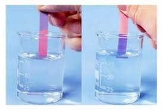

<!DOCTYPE html>
<html lang="es">
<head>
    <meta charset="UTF-8">
    <meta name="viewport" content="width=device-width, initial-scale=1.0">
    <title>Química: Materia, Sistemas Ácido-Base y pH</title>
    
</head>
<body>
    <header class="header">
        <h1>Información sobre el pH</h1>
    </header>

    

        <nav class="sidebar">
            <h2>Índice</h2>
            <ul>
                <li><a href="#historia">Historia</a></li>
                <li><a href="#definicion">Definición</a></li>
                <li><a href="#ph">pH</a></li>
                <li><a href="#poh">pOH</a></li>
                <li><a href="#medicion">Medición</a></li>
                <li><a href="#indicadores">Indicadores de pH</a></li>
                <li><a href="#soluciones">Soluciones no acuosas</a></li>
                <li><a href="#escala">Escala de pH absoluta unificada</a></li>
                <li><a href="#extremos">Extremos de las mediciones de pH</a></li>
                <li><a href="#aplicaciones">Aplicaciones</a></li>
                <li><a href="#ph-suelo">pH en el suelo</a></li>
                <li><a href="#ph-plantas">pH en las plantas</a></li>
                <li><a href="#ph-oceano">pH en el océano</a></li>
                <li><a href="#escalas-oceanografia">Tres escalas de pH en oceanografía</a></li>
                <li><a href="#ph-alimentos">pH en los alimentos</a></li>
                <li><a href="#ph-fluidos">pH de varios fluidos corporales</a></li>
                <li><a href="#calculos">Cálculos de pH</a></li>
                <li><a href="#acidos-bases">Ácidos y bases fuertes/débiles</a></li>
                <li><a href="#metodo">Método general</a></li>
                <li><a href="#referencias">Referencias</a></li>
                <li><a href="#visto-tambien">Véase también</a></li>
            </ul>
        </nav>

        <main class="content-section">
            
La comprensión de la materia y sus transformaciones constituye uno de los pilares fundamentales de la química moderna. Este estudio examina las clasificaciones esenciales de la materia, profundiza en el comportamiento del agua como solvente universal y analiza los conceptos fundamentales de los sistemas ácido-base.

            <section id="historia">
                <h2>Historia</h2>
                
El concepto de pH fue introducido en 1909 por Søren P. L. Sørensen, un químico danés, para expresar la acidez o alcalinidad de soluciones. Desde entonces, ha sido fundamental en diversas áreas de la química, biología y medicina.

                

                    
                

            </section>

            <section id="definicion">
                <h2>Definición</h2>
                
El pH es una medida que expresa el grado de acidez o alcalinidad de una solución acuosa. Representa la concentración de iones hidrógeno (H⁺) en la solución, que determina si es ácida, neutra o alcalina.

                
<strong>Clasificación de soluciones:</strong>

                <ul>
                    <li>Ácido: pH < 7 (ejemplo: jugo de limón)</li>
                    <li>Neutro: pH = 7 (ejemplo: agua pura)</li>
                    <li>Alcalino: pH > 7 (ejemplo: solución de bicarbonato)</li>
                </ul>
                

                    
                

            </section>

            <section id="ph">
                <h2>pH</h2>
                
El pH se mide en una escala que va de 0 a 14. Un pH menor que 7 indica acidez, mientras que un pH mayor que 7 indica alcalinidad. El pH 7 es considerado neutro.

            </section>

            <section id="poh">
                <h2>pOH</h2>
                
El pOH es otra medida que indica la concentración de iones hidroxilo (OH⁻) en una solución. La relación entre pH y pOH es: pH + pOH = 14.

            </section>

            <section id="medicion">
                <h2>Medición</h2>
                
El pH se puede medir mediante varios métodos, incluyendo el uso de un potenciómetro y papel indicador de pH.

            </section>

            <section id="indicadores">
                <h2>Indicadores de pH</h2>
                
Los indicadores son sustancias que cambian de color dependiendo del pH de la solución. Por ejemplo, la fenolftaleína es incolora en pH ácido y se torna rosa en pH básico.

                

                    
                

            </section>

            <section id="soluciones">
                <h2>Soluciones no acuosas</h2>
                
El concepto de pH también puede aplicarse a soluciones no acuosas, aunque es menos común. En estos casos, se utilizan escalas específicas dependiendo del solvente.

            </section>

            <section id="escala">
                <h2>Escala de pH absoluta unificada</h2>
                
La escala de pH puede ser ajustada para representar de manera más precisa la acidez y alcalinidad de soluciones en diferentes contextos, incluyendo condiciones extremas.

            </section>

            <section id="extremos">
                <h2>Extremos de las mediciones de pH</h2>
                
Las mediciones de pH pueden llegar a extremos, con pH inferiores a 0 o superiores a 14 en condiciones específicas, lo que requiere una comprensión de la química subyacente.

            </section>

            <section id="aplicaciones">
                <h2>Aplicaciones</h2>
                
El pH tiene numerosas aplicaciones en diversos campos:

                <ul>
                    <li>Industria alimentaria: Control del pH para asegurar la calidad y seguridad de los alimentos.</li>
                    <li>Medicina: El pH de la sangre es crucial para el diagnóstico de diversas condiciones de salud.</li>
                    <li>Medio ambiente: El pH del suelo y del agua afecta la vida acuática y la salud del ecosistema.</li>
                </ul>
                

                    
                

            </section>

            <section id="ph-suelo">
                <h2>pH en el suelo</h2>
                
El pH del suelo influye en la disponibilidad de nutrientes para las plantas, afectando su crecimiento y desarrollo.

                

                    
                

            </section>

            <section id="ph-plantas">
                <h2>pH en las plantas</h2>
                
Las plantas tienen rangos óptimos de pH que favorecen la absorción de nutrientes, siendo fundamental para su salud y producción.

                

                    
                

            </section>

            <section id="ph-oceano">
                <h2>pH en el océano</h2>
                
El pH del océano afecta la vida marina, siendo un factor crítico en la salud de ecosistemas marinos.

                

                    
                

            </section>

            <section id="escalas-oceanografia">
                <h2>Tres escalas de pH en oceanografía</h2>
                
Existen diferentes escalas de pH utilizadas en oceanografía para evaluar el impacto del cambio climático en los océanos.

            </section>

            <section id="ph-alimentos">
                <h2>pH en los alimentos</h2>
                
El pH de los alimentos puede influir en su sabor, textura y conservación.

            </section>

            <section id="ph-fluidos">
                <h2>pH de varios fluidos corporales</h2>
                
El pH de los fluidos corporales, como la saliva y el jugo gástrico, es vital para la función metabólica y la digestión.

            </section>

            <section id="calculos">
                <h2>Cálculos de pH</h2>
                
El cálculo del pH se basa en la concentración de iones H⁺. Se utiliza la siguiente fórmula:

                
<strong>pH = -log[H⁺]</strong>

            </section>

            <section id="acidos-bases">
                <h2>Ácidos y bases fuertes/débiles</h2>
                
Los ácidos y bases se clasifican en fuertes y débiles según su grado de disociación en solución:

                <ul>
                    <li><strong>Ácidos fuertes:</strong> Se disocian completamente en solución (ejemplo: HCl).</li>
                    <li><strong>Ácidos débiles:</strong> No se disocian completamente (ejemplo: ácido acético).</li>
                    <li><strong>Bases fuertes:</strong> Se disocian completamente en solución (ejemplo: NaOH).</li>
                    <li><strong>Bases débiles:</strong> No se disocian completamente (ejemplo: amoníaco).</li>
                </ul>
                

                    
                

            </section>

            <section id="metodo">
                <h2>Método general</h2>
                
El método para determinar el pH incluye el uso de electrodos y la aplicación de fórmulas químicas para calcular el pH en diversas soluciones.

            </section>

            <section class="reference">
                <h2 id="referencias">Referencias</h2>
                <ul>
                    <li>Brown, T. L., et al. (2023). <em>Chemistry: The Central Science</em> (15th ed.). Pearson.</li>
                    <li>Chang, R., & Goldsby, K. A. (2024). <em>Chemistry</em> (14th ed.). McGraw-Hill Education.</li>
                    <li>Petrucci, R. H., et al. (2022). <em>General Chemistry: Principles and Modern Applications</em> (12th ed.).</li>
                    <li>Zumdahl, S. S., & Zumdahl, S. A. (2023). <em>Chemistry</em> (11th ed.).</li>
                    <li>Atkins, P., & de Paula, J. (2023). <em>Physical Chemistry</em> (12th ed.).</li>
                    <li>Enciclopedia Británica. (2022). pH. En <em>Enciclopedia Británica</em>.</li>
                    <li>Enciclopedia de Ciencias Naturales. (2021). Propiedades del pH. En <em>Enciclopedia de Ciencias Naturales</em>.</li>
                </ul>
            </section>

            <section id="visto-tambien">
                <h2>Véase también</h2>
                <ul>
                    <li>Reacciones ácido-base</li>
                    <li>Buffers</li>
                    <li>Soluciones acuosas</li>
                </ul>
            </section>
        </main>
    

</body>
</html>
